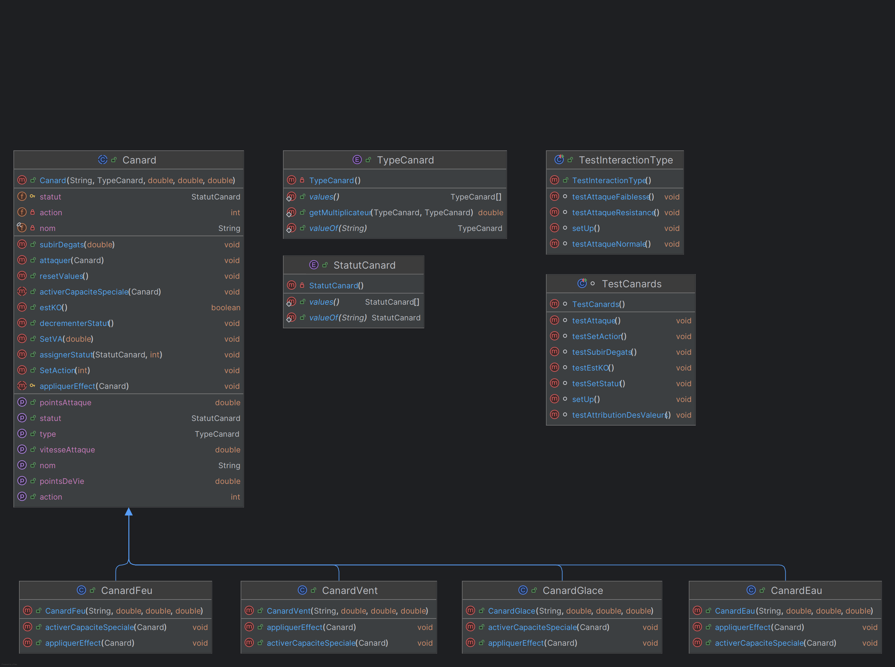

PS : Le visuel du readme à était fait avec ChatGPT

# 🦆 Canard Fighter Simulator

## 📌 Description du projet

**Canard Fighter Simulator** est un jeu de combat où des canards dotés de différents types (**Eau, Feu, Glace, Vent, etc.**) s'affrontent en utilisant des attaques et des capacités spéciales.
Ce projet illustre des concepts clés de la **programmation orientée objet (POO)** tels que :
- **L'héritage**
- **Le polymorphisme**
- **La modularité**

---

## 📊 Diagramme UML des classes

📌 *Voir* `diagramme_classe.png`

Le modèle suit une approche **orientée objet** avec :
- Une **classe de base** `Canard`.
- Des **sous-classes** représentant différents types de canards.
- Une gestion des interactions entre les types via un `enum TypeCanard`.
- Chaque canard possède **des attaques et une capacité spéciale unique**.

---

## 🔧 Choix techniques

- **Langage** : Java ☕
- **Modularité** : Séparation de la logique métier via **classes et héritage**.
- **Polymorphisme** : Attaques et capacités spéciales implémentées via **méthodes redéfinies**.
- **Gestion des forces/faiblesses** : `enum TypeCanard` définit les multiplicateurs d'attaque.
- **Interface utilisateur** : Menu en **ligne de commande** pour créer des canards et les faire combattre.
- **Tests unitaires** : Vérification des **interactions entre types** et du **comportement des méthodes principales**.

---

## ❓ Questions et réflexions

### 1️⃣ Quelles classes pourraient être abstraites ?
✅ La classe `Canard` pourrait être abstraite car elle définit un **comportement commun** (nom, PV, PA, type, attaque, subir dégâts).

🔹 Ses sous-classes (`CanardEau`, `CanardFeu`, `CanardGlace`, `CanardVent`) implémenteraient des **spécificités propres**.

### 2️⃣ Quels comportements communs pourraient être définis dans une interface ?
✅ Une interface `CapaciteSpeciale` pourrait définir la méthode :
```java
void activerCapaciteSpeciale();
```
🔹 Chaque sous-classe l’implémenterait selon ses spécificités, séparant ainsi **la logique des capacités** du reste de `Canard`.

### 3️⃣ Comment représenter un changement de statut (ex: brûlé ou paralysé) ?
✅ Une `enum Statut` pourrait être utilisée avec des valeurs :
```java
NORMAL, BRULE, MOUILLE, GELE
```
🔹 Chaque `Canard` aurait un attribut `statutActuel` et une méthode :

```java
import canards.StatutCanard;

void appliquerStatut(StatutCanard statut);
```
🔹 Cela permettrait de **gérer les effets de statut en combat**.

### 4️⃣ Quels sont les avantages d’une classe ou interface pour gérer les capacités spéciales ?
✅ **Modularité** : Ajout de nouvelles capacités **sans modifier `Canard`**.
✅ **Extensibilité** : Facilité d'intégrer de **nouvelles capacités** via des implémentations de `CapaciteSpeciale`.
✅ **Réutilisabilité** : Plusieurs types de canards pourraient **partager une même capacité**.

### 5️⃣ Quels défis sont associés à l’extensibilité du modèle ?
⚠️ **Gestion des forces/faiblesses** : Ajouter un **nouveau type de canard** implique de **redéfinir la logique des dégâts**.
⚠️ **Compatibilité des capacités** : Certaines capacités pourraient **ne pas s'appliquer à tous les types**.
⚠️ **Équilibrage du jeu** : Ajouter **de nouveaux canards et capacités** peut déséquilibrer le jeu.

---

## 📢 Conclusion
Ce projet offre une **approche ludique et didactique** pour explorer la **programmation orientée objet**, tout en permettant une évolution flexible du modèle grâce à une architecture bien pensée.
